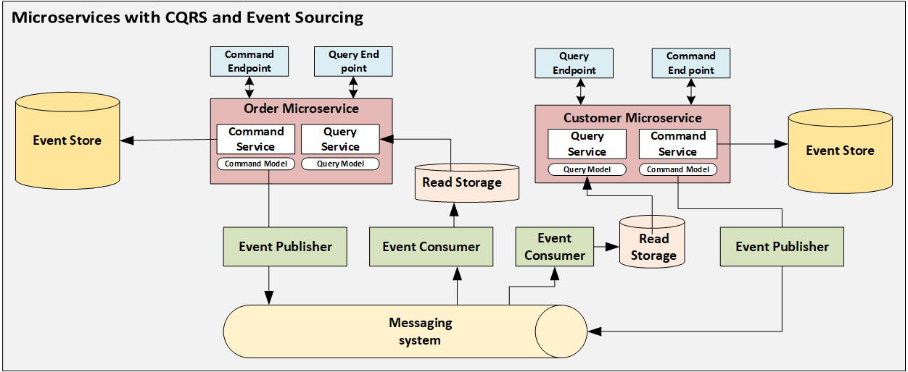

<p align="center"><a href="https://profile-forme.com" target="_blank"></a></p>

<p align="center">
<a href="https://www.linkedin.com/in/tai-nguyen-tien-787545213/"></a>
<a href="https://profile-forme.surge.sh"></a>
<a href="tel:0798805741"></a>
<a href = "mailto:nguyentientai10@gmail.com"></a>
</p>

# CQRS-ES System flow images.

<p align="center"></p>

This project implements a Command Query Responsibility Segregation (CQRS) and Event Sourcing (ES) system, designed to handle complex business operations and ensure high performance and scalability. It uses a microservices architecture, leveraging various technologies such as MongoDB, PostgreSQL, RabbitMQ, and Docker for development and deployment.

# Structure Folder

```
.
├── .dockerignore
├── .env
├── .env.example
├── .gitignore
├── .vscode/
│   └── settings.json
├── docker/
│   └── Dockerfile
├── docker-compose.yml
├── makefile
├── mongo/
│   ├── conf/
│   │   └── mongod.conf
│   └── init.sh
├── package.json
├── README.md
├── server.js
└── src/
    ├── app.js
    ├── app/
    │   └── v1/
    │       ├── controllers/
    │       ├── models/
    │       ├── routes/
    │       └── services/
    ├── commands/
    │   ├── handlers/
    │   └── models/
    ├── configs/
    ├── constants/
    ├── cors/
    ├── inits/
    ├── events/
    │   ├── models/
    │   └── subscribers/
    ├── globals/
    ├── helpers/
    ├── middlewares/
    ├── models/
    ├── queries/
    │   ├── handlers/
    │   └── models/
    ├── subscribers/
    └── utils/
```

This README.md file outlines the directory structure of a software project that follows the Command Query Responsibility Segregation (CQRS) and Event Sourcing (ES) patterns. Here's a breakdown of the structure and the purpose of each directory:

# Vietnamese 🇻🇳

- `.`: Thư mục gốc của dự án, chứa các tệp cấu hình và thư mục cho việc thiết lập dự án.
  - `.dockerignore`: Chỉ định các tệp và thư mục để bỏ qua khi xây dựng hình ảnh Docker.
  - `.env` và `.env.example`: Tệp cấu hình môi trường, với `.env.example` làm mẫu.
  - `.gitignore`: Liệt kê các tệp và thư mục mà Git nên bỏ qua.
  - `.vscode/`: Chứa cài đặt cụ thể cho Visual Studio Code.
    - `settings.json`: Cài đặt cấu hình cho VS Code.
  - `docker/`: Chứa các tệp liên quan đến Docker.
    - `Dockerfile`: Hướng dẫn để xây dựng hình ảnh Docker.
  - `docker-compose.yml`: Định nghĩa và chạy các ứng dụng Docker đa container.
  - `git.sh`: Một kịch bản shell liên quan đến các thao tác Git, có thể dùng cho tự động hóa.
  - `makefile`: Định nghĩa một tập hợp các nhiệm vụ để thực thi.
  - `mongo/`: Cấu hình cụ thể cho MongoDB và các kịch bản khởi tạo.
    - `conf/`: Chứa các tệp cấu hình MongoDB.
    - `init.sh`: Kịch bản để khởi tạo MongoDB.
  - `package.json`: Định nghĩa các phụ thuộc và kịch bản gói npm.
  - `README.md`: Tệp này, mô tả dự án và cấu trúc của nó.
  - `server.js`: Điểm nhập chính cho ứng dụng Node.js.
  - `src/`: Mã nguồn của ứng dụng, được tổ chức vào các thư mục cụ thể cho CQRS và ES.
    - `app.js`: Kịch bản ứng dụng chính.
    - `app/`: Chứa mã nguồn cụ thể cho các ứng dụng, bao gồm controllers, models, routes, và services.
      - `v1/`: Thư mục cho phiên bản 1 của API, bao gồm controllers, models, routes, và services.
        - `controllers/`: Xử lý các yêu cầu đến từ người dùng và trả về phản hồi.
        - `models/`: Định nghĩa cấu trúc dữ liệu và mô hình.
        - `routes/`: Định nghĩa các tuyến đường API.
        - `services/`: Xử lý logic nghiệp vụ.
    - `commands/`: Chứa các trình xử lý lệnh và mô hình, xử lý các thao tác ghi.
      - `handlers/`: Logic để xử lý các lệnh.
      - `models/`: Mô hình đặc biệt cho phía lệnh của CQRS.
    - `configs/`: Các tệp cấu hình cho cơ sở dữ liệu và các dịch vụ khác.
    - `constants/`: Hằng số được sử dụng trong toàn bộ ứng dụng.
    - `cors/`: Cấu hình cho Cross-Origin Resource Sharing.
    - `inits/`: Kịch bản khởi tạo cơ sở dữ liệu.
    - `events/`: Chứa các mô hình sự kiện và người đăng ký, trung tâm của Event Sourcing.
      - `models/`: Mô hình đại diện cho các sự kiện trong hệ thống.
      - `subscribers/`: Các trình xử lý phản ứng với sự kiện.
    - `globals/`: Biến toàn cục hoặc cấu hình.
    - `helpers/`: Các hàm tiện ích và trợ giúp.
    - `middlewares/`: Chứa các middleware cho Express, như xác thực, ghi log, v.v.
    - `models/`: Mô hình chung cho ứng dụng, phản ánh trạng thái hiện tại sau khi áp dụng sự kiện.
    - `queries/`: Chứa các trình xử lý truy vấn và mô hình, xử lý các thao tác đọc.
      - `handlers/`: Logic để xử lý truy vấn.
      - `models/`: Mô hình đặc biệt cho phía truy vấn của CQRS.
    - `subscribers/`: Được cập nhật để xử lý sự kiện từ lệnh/truy vấn, tạo điều kiện cho bản chất phản ứng của hệ thống.
    - `utils/`: Chứa các hàm tiện ích dùng chung trong toàn bộ ứng dụng.

# English 🏴󠁧󠁢󠁥󠁮󠁧󠁿

- `.`: The project's root directory, containing configuration files and setup directories.
  - `.dockerignore`: Specifies files and directories to ignore when building a Docker image.
  - `.env` and `.env.example`: Environment configuration files, with `.env.example` serving as a template.
  - `.gitignore`: Lists files and directories that Git should ignore.
  - `.vscode/`: Contains settings specific to Visual Studio Code.
    - `settings.json`: Configuration settings for VS Code.
  - `docker/`: Contains Docker-related files.
    - `Dockerfile`: Instructions to build the Docker image.
  - `docker-compose.yml`: Defines and runs multi-container Docker applications.
  - `git.sh`: A shell script related to Git operations, potentially used for automation.
  - `makefile`: Defines a set of tasks to be executed.
  - `mongo/`: Specific configuration for MongoDB and initialization scripts.
    - `conf/`: Contains MongoDB configuration files.
    - `init.sh`: Script to initialize MongoDB.
  - `package.json`: Defines npm package dependencies and scripts.
  - `README.md`: This file, describing the project and its structure.
  - `server.js`: The main entry point for the Node.js application.
  - `src/`: The application’s source code, organized into directories for CQRS and ES.
    - `app.js`: The main application script.
    - `app/`: Contains application-specific code, including controllers, models, routes, and services.
      - `v1/`: Directory for version 1 of the API, including controllers, models, routes, and services.
        - `controllers/`: Handles incoming user requests and returns responses.
        - `models/`: Defines data structures and models.
        - `routes/`: Defines API routes.
        - `services/`: Handles business logic.
    - `commands/`: Contains command handlers and models, handling write operations.
      - `handlers/`: Logic for handling commands.
      - `models/`: Models specific to the command side of CQRS.
    - `configs/`: Configuration files for databases and other services.
    - `constants/`: Constants used throughout the application.
    - `cors/`: Configuration for Cross-Origin Resource Sharing.
    - `inits/`: All Database, Cache, socket,... initialization scripts.
    - `events/`: Contains event models and subscribers, central to Event Sourcing.
      - `models/`: Models representing events in the system.
      - `subscribers/`: Handlers reacting to events.
    - `globals/`: Global variables or configurations.
    - `helpers/`: Utility functions and helpers.
    - `middlewares/`: Contains middleware for Express, such as authentication, logging, etc.
    - `models/`: Common models for the application, reflecting the current state after event application.
    - `queries/`: Contains query handlers and models, handling read operations.
      - `handlers/`: Logic for handling queries.
      - `models/`: Models specific to the query side of CQRS.
    - `subscribers/`: Updated to handle events from command/query, facilitating the system's reactive nature.
    - `utils/`: Contains utility functions shared across the application.

This structure supports the separation of concerns as advocated by CQRS and leverages Event Sourcing for maintaining the state of the application through events.

## Tài Khoản Donate li Cf để có động lực code cho anh em tham khảo 😄😄


## Mk: NGUYEN TIEN TAI

## STK: 1651002972052

## Chi Nhánh: NGAN HANG TMCP AN BINH (ABBANK)

## SUPORT CONTACT: [https://profile-forme.com](https://profile-forme.com/).
